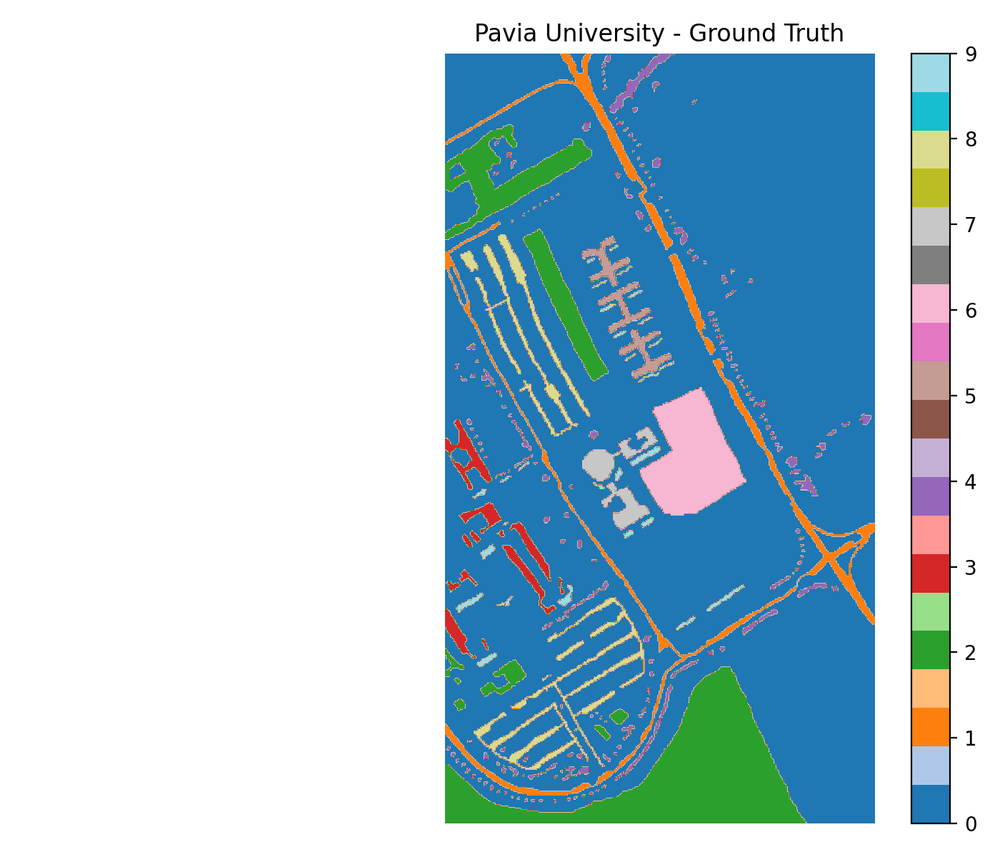
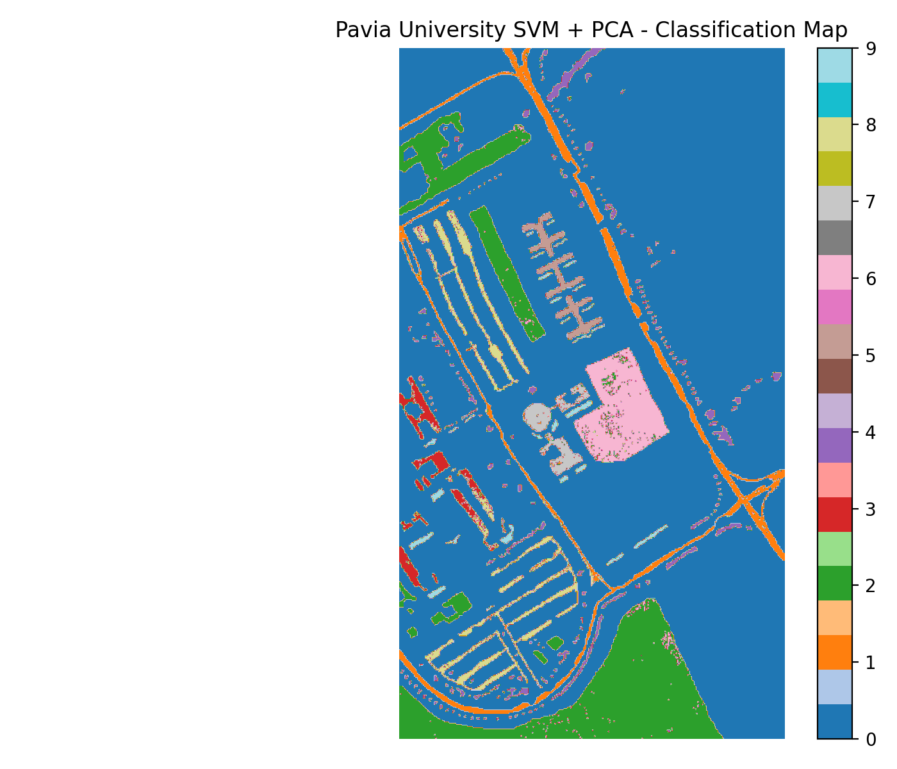
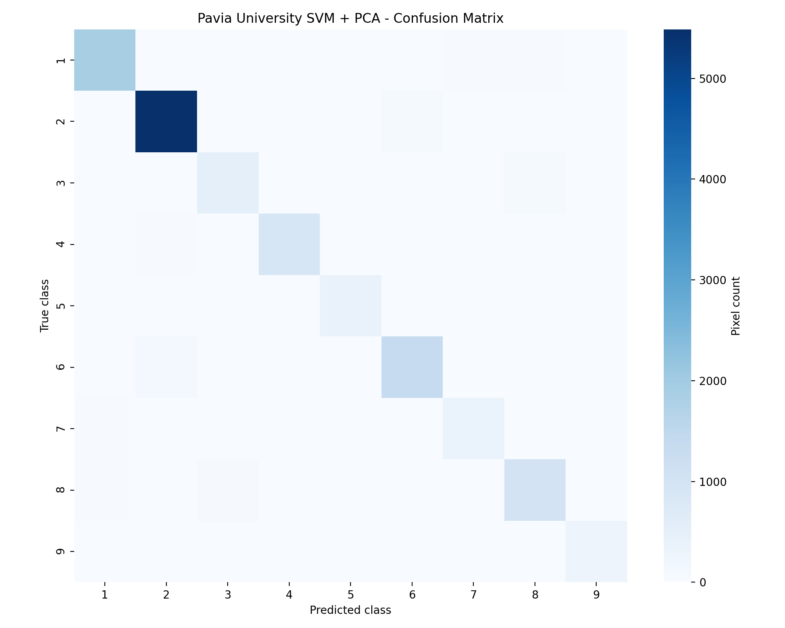
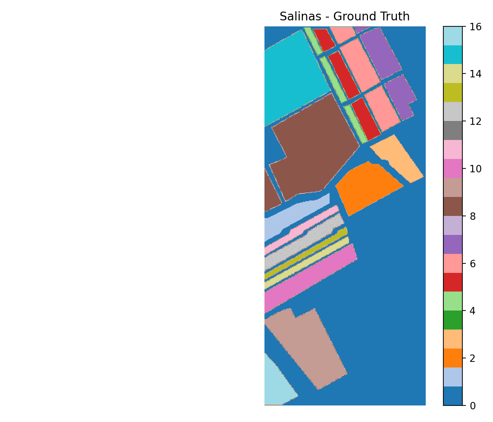
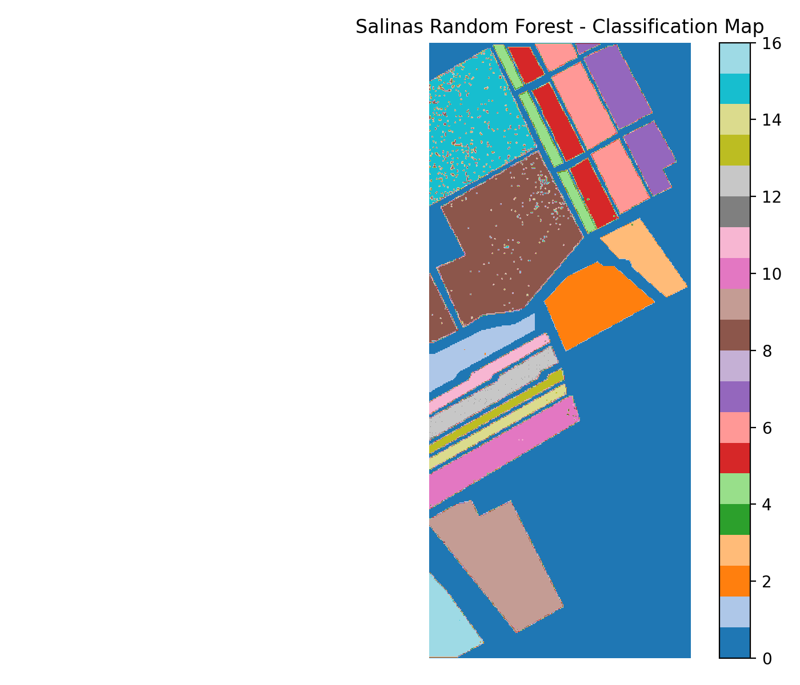
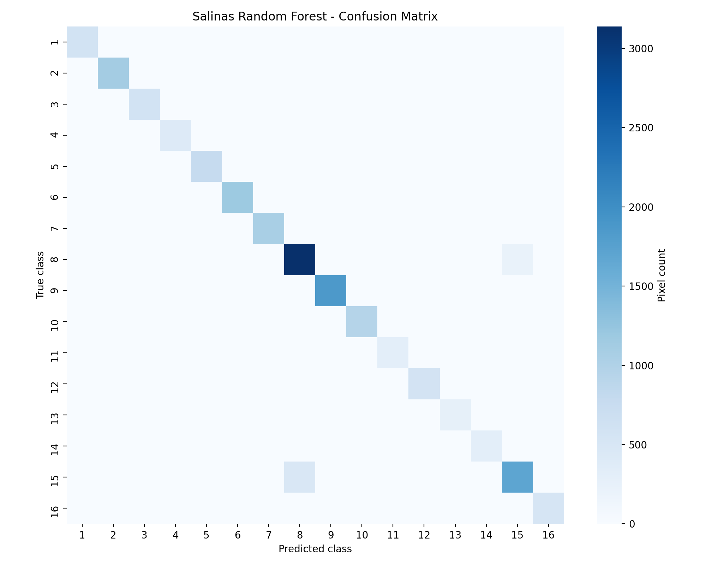

# Hyperspectral Image Classification

This project compares classical machine learning approaches on benchmark hyperspectral image classification datasets. It uses Pavia University and Salinas, two widely used remote sensing benchmarks with ground-truth labels.

The project demonstrates a complete experimental workflow:

- Dataset exploration
- Class distribution analysis
- SVM + PCA baseline training
- Random Forest baseline training
- Overall, average, kappa, confusion matrix, and per-class evaluation
- Full-scene classification map generation

## Datasets

- Pavia University
- Salinas

The datasets are widely used hyperspectral remote sensing benchmarks and include ground-truth labels.

Dataset source: https://www.ehu.eus/ccwintco/index.php/Hyperspectral_Remote_Sensing_Scenes

## Planned Experiments

| Experiment | Dataset | Model | Preprocessing |
|---|---|---|---|
| E1 | Pavia University | SVM | StandardScaler + PCA |
| E2 | Salinas | SVM | StandardScaler + PCA |
| E3 | Pavia University | Random Forest | Spectral features |
| E4 | Salinas | Random Forest | Spectral features |

## Completed Baseline Results

Train/test split is stratified with 70% training and 30% testing. SVM uses StandardScaler, PCA with 30 components, and an RBF kernel. Random Forest uses 300 trees and balanced class weights.

| Dataset | Model | Overall Accuracy | Average Accuracy | Kappa |
|---|---|---:|---:|---:|
| Pavia University | SVM + PCA | 0.9542 | 0.9402 | 0.9392 |
| Salinas | SVM + PCA | 0.9394 | 0.9730 | 0.9324 |
| Pavia University | Random Forest | 0.9262 | 0.8978 | 0.9011 |
| Salinas | Random Forest | 0.9512 | 0.9747 | 0.9456 |

## Current Comparison

- On Pavia University, SVM + PCA performs better than Random Forest across all reported metrics.
- On Salinas, Random Forest performs better than SVM + PCA across all reported metrics.
- This indicates that model performance is dataset-dependent and should be evaluated with per-dataset baselines instead of assuming one model is always superior.

The full comparison table is generated automatically at:

- `results/metrics/experiment_comparison.csv`
- `results/metrics/experiment_comparison.md`

## Classification Maps

Full-scene classification maps were generated for the best model of each dataset:

- Pavia University: `results/figures/pavia_svm_pca_classification_map.png`
- Salinas: `results/figures/salinas_random_forest_classification_map.png`

### Pavia University

Ground truth:



Best model classification map:



Confusion matrix:



### Salinas

Ground truth:



Best model classification map:



Confusion matrix:



## Key Findings

- SVM + PCA achieved the best result on Pavia University with 0.9542 overall accuracy.
- Random Forest achieved the best result on Salinas with 0.9512 overall accuracy.
- The best-performing model changed by dataset, which shows why hyperspectral classification experiments should be evaluated across multiple benchmarks.
- Per-class analysis revealed that difficult classes such as `Gravel`, `Bitumen`, `Grapes_untrained`, and `Vinyard_untrained` require more careful modeling.

## Metrics

- Overall Accuracy
- Average Accuracy
- Cohen's Kappa
- Confusion Matrix
- Per-class accuracy

## Project Structure

```text
proje1/
  data/             # Local dataset files, not tracked by Git
  notebooks/        # Exploratory notebooks
  src/              # Reusable Python scripts
  results/
    figures/        # Plots and maps
    metrics/        # CSV/JSON metric outputs
    models/         # Trained model artifacts, not tracked by Git
```

## Notes

Large `.mat` dataset files are kept locally under `data/` and are intentionally excluded from Git.

## Reproduce

Use Python 3. On this machine, the `python` command points to Python 2.7, so use `py -3`.

```powershell
py -3 src\explore_datasets.py --dataset all
py -3 src\train_svm.py --dataset pavia --test-size 0.3 --pca-components 30 --random-state 42
py -3 src\train_svm.py --dataset salinas --test-size 0.3 --pca-components 30 --random-state 42
py -3 src\train_random_forest.py --dataset pavia --test-size 0.3 --n-estimators 300 --random-state 42
py -3 src\train_random_forest.py --dataset salinas --test-size 0.3 --n-estimators 300 --random-state 42
py -3 src\compare_results.py
py -3 src\predict_map.py --dataset pavia --model svm_pca
py -3 src\predict_map.py --dataset salinas --model random_forest
```
